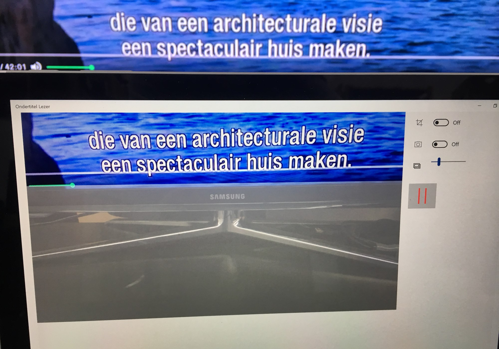
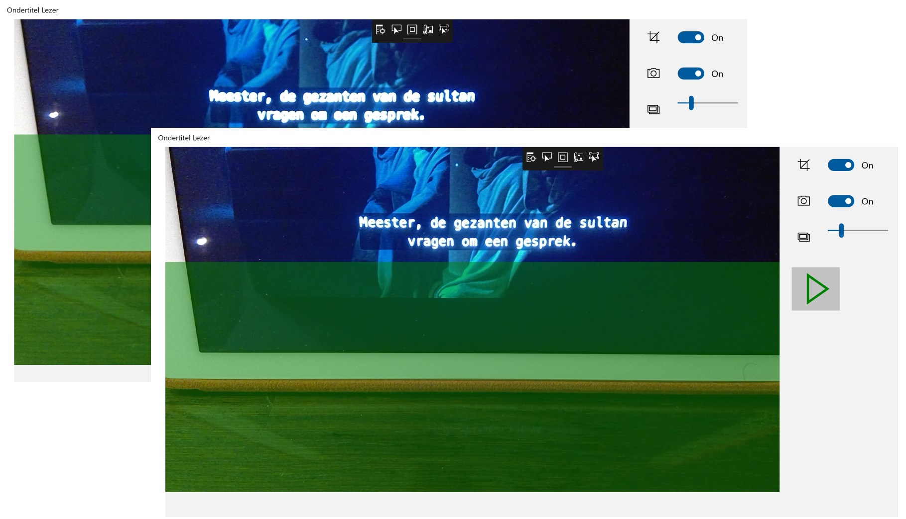
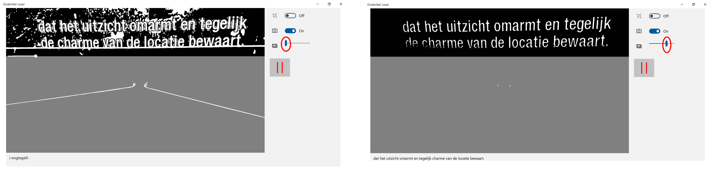

# Ondertitel Voorlezer via Windows tablet
In het programma [Team Scheire](https://www.canvas.be/team-scheire) bouwden we een applicatie om ondertitels op een TV scherm over te zetten naar digitale tekst en deze uit te lezen via Tekst-naar-Spraak.
Dit is een voorbeeld en we hopen dat dit jullie inspireert om zelf een oplossing te bedenken. Het platform dat we gebruiken is Universal Windows Platform (UWP). 

    Dit project bevat geen productiecode en dient enkel als voorbeeld.

# Vereisten om de app te draaien
Om de app zelf op je Windows 10 tablet te draaien dienen deze (gratis) ontwikkelaarstools geïnstalleerd te worden:
1.	Hardware: Windows 10 tablet met een camera op de achterkant (de code kan wel aangepast worden om externe camera's te gebruiken). Ook aangeraden van over een touchscreen te beschikken om beeld in focus te brengen. Minimale Windows versie 1803. Je kan de vereiste versie wel verlagen in Visual Studio en zo eerdere versies ondersteunen.
1. Windows Tekst-naar-Spraak taalpakket Nederlands België: [download hier](https://support.office.com/nl-nl/article/het-downloaden-van-tekst-naar-spraak-talen-voor-windows-10-d5a6b612-b3ae-423f-afa5-4f6caf1ec5d3?omkt=nl-NL&ui=nl-NL&rs=nl-NL&ad=NL)
1.	Visual Studio 2017 Update 5+ voor Windows (Community Edition is een gratis versie beschikbaar [hier](https://developer.microsoft.com/en-us/windows/downloads))
1.	Clone deze repo.
1.	Open de solution file onder /scr/ in Visual Studio.
1.  Compileer de app en start debug mode om de app op te starten.

# De app en tablet correct afstellen op een TV
De positie van de tablet en verhouding tegenover het beeld van de TV is erg belangrijk om geschreven tekst goed te kunnen 'lezen' (extract).

## Camera afstellen op uw TV-beeld
Positioneer de tablet in een goede verhouding tegenover de ondertitels die verschijnen op TV. 

### Focus op ondertitels
Het is aangeraden om het beeld goed te focussen op de ondertitels. Druk me je vinger op het gebied van de ondertitels en de camera zal focus proberen in te stellen op dat gebied. Je kan nog eens drukken op de touchscreen om focus weg te halen, en nog eens drukken om terug te focussen. Verzeker je ervan dat focus goed staat voor je op de Startknop drukt. 

## Opties in de app
1.  Keuze uit OCR toepassen op het volledige beeld of enkel een derde van beeld: deze optie is handig als men al dan niet enkel ondertitels wenst te lezen.
1.  Beeldoptimalisatie naar zwart-wit: in de meeste gevallen zal OCR beter werken in deze modus. 
    -  Bijkomend in deze modus kan de gradatie van het z/w en blur effecten op het beeld afgestemd worden met de schuifregelaar (slider). Je ziet deze ook op het beeld verschijnen met de toepassing van de effecten om zelf in te schatten hoe goed het TV beeld en de ondertitels worden verwerkt door de OCR.
1. Start/Stop knop.

### Voorbeeld instellingen Zwart-wit

1. Met donker beeld zet je de threshold best rond de 0.2 punten.
2. Met een beeld waar de contrasten lager zitten is het vaak heel handig om de schuifregelaar naar 0.6 of zelfs 0.8 te zetten.

# Technologie
We maken gebruik van Windows APIs voor het lezen van videobeelden van TV. Daarna passen we OCR toe op het beeld mits wat optimalisaties. Bij een succesvolle toepassing van OCR wordt de ontcijferde tekst doorgestuurd naar een media element waarbij Text-to-Speech API zorgt voor het voorlezen.
De applicatie werkt volledig offline. 
Meer informatie over deze APIs:
- OCR: https://blogs.windows.com/buildingapps/2016/02/08/optical-character-recognition-ocr-for-windows-10/
- Text-to-Speech: https://docs.microsoft.com/en-us/uwp/api/Windows.Media.SpeechSynthesis.SpeechSynthesizer
- Media: https://docs.microsoft.com/en-us/windows/uwp/audio-video-camera/play-audio-and-video-with-mediaplayer en https://docs.microsoft.com/en-us/uwp/api/windows.ui.xaml.controls.mediaelement

## Verdere ontwikkelingen
Er zijn een aantal technologieën die verder worden bekeken om deze app beter te laten presteren. Intussen evolueert de technologie enorm snel en is het zelfs mogelijk geworde om bijvoorbeeld machine learning toe te passen in Windows apps [zie hier](https://docs.microsoft.com/en-us/windows/ai/). Deze optie was bij aanvang van het project niet eens mogelijk. Dit kan enorme verbeteringen betekenen, bijvoorbeeld:

- Custom vision/OCR trainen op ondertitels
- Spell checking
- Predicties op 'volgend woord'
- ...

### Licentie

Zie [LICENSE](LICENSE)

